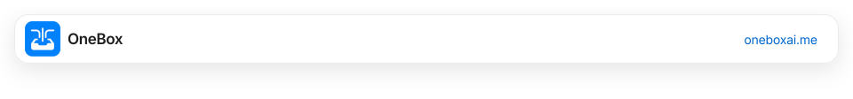
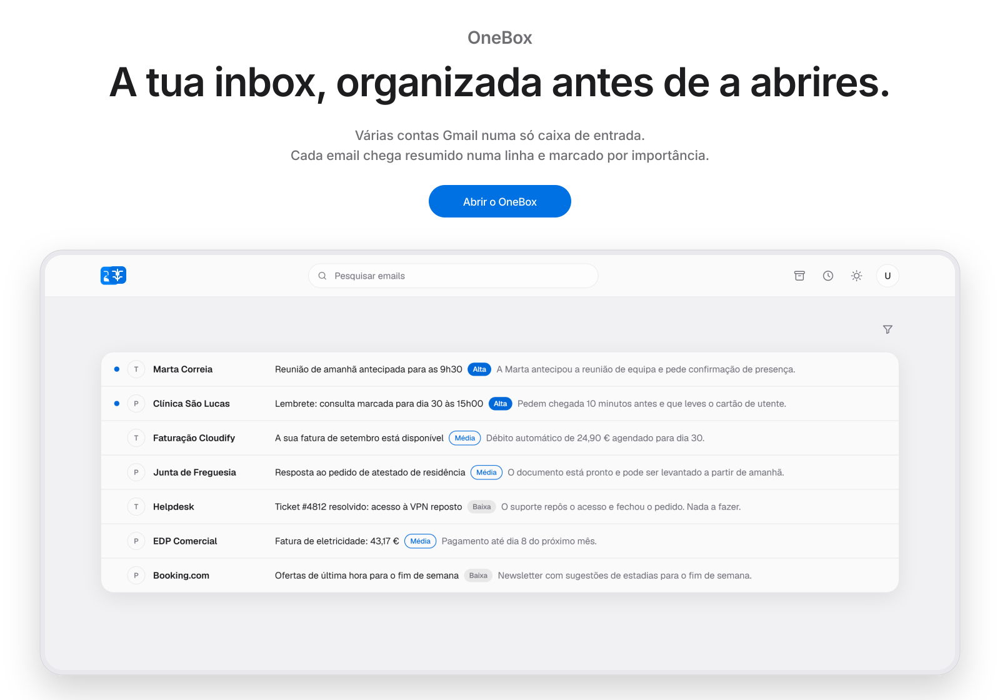
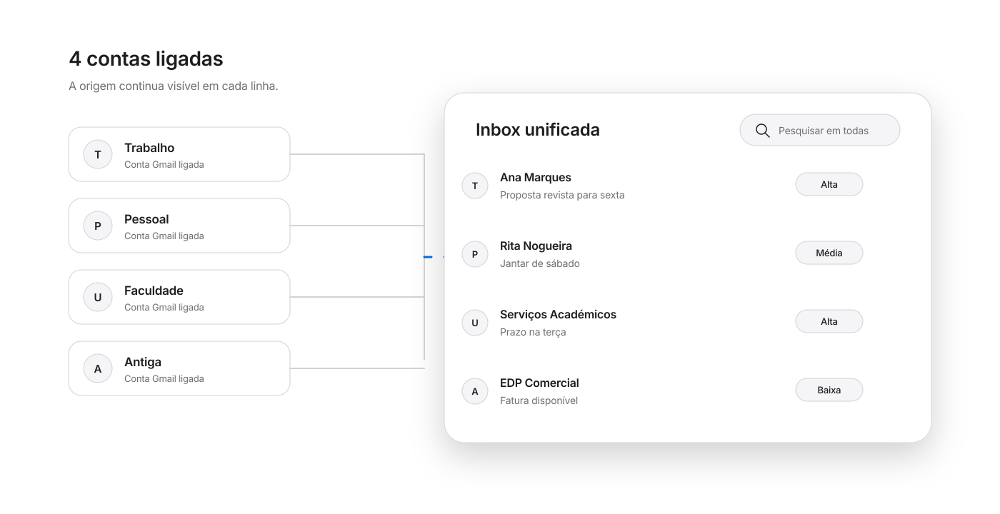
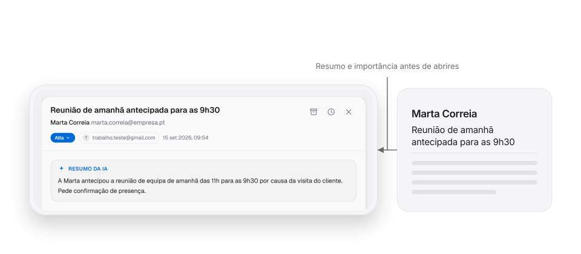
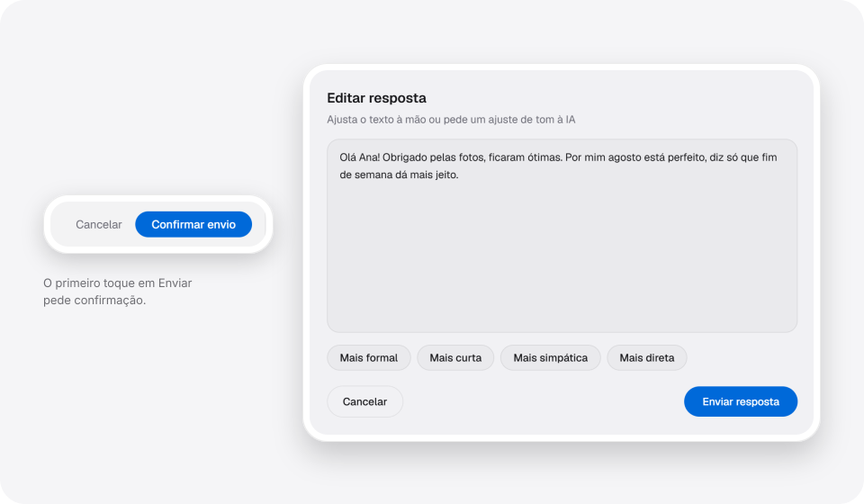
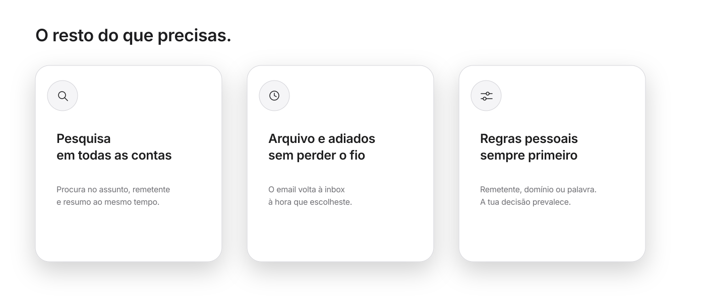
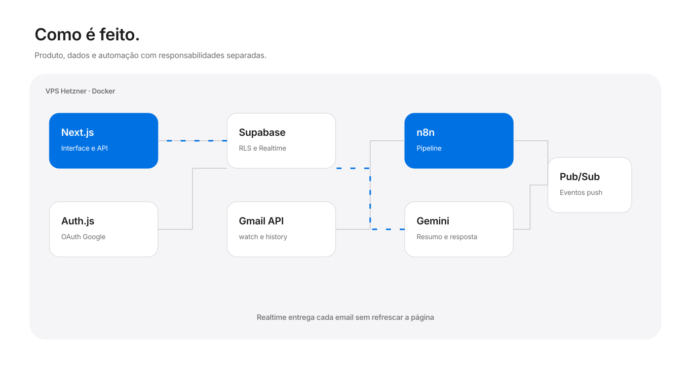
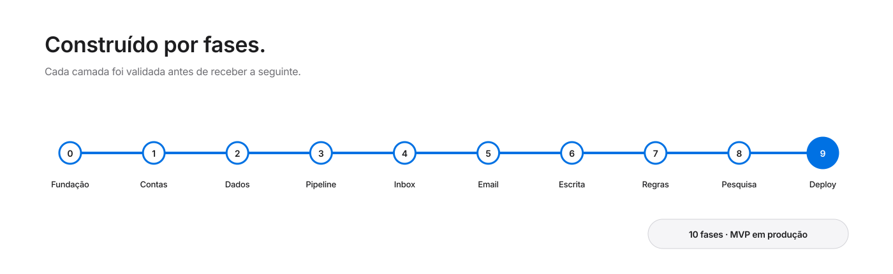

<picture>
  <source media="(prefers-color-scheme: dark)"
    srcset="docs/readme/nav-dark.svg">
  
</picture>

<p align="center">
  <a href="#produto">Produto</a> ·
  <a href="#como-funciona">Como funciona</a> ·
  <a href="#por-dentro">Por dentro</a> ·
  <a href="#correr-localmente">Correr localmente</a>
</p>

<h1 align="center">A tua inbox, organizada antes de a abrires.</h1>

<p align="center">
  Várias contas Gmail numa só caixa de entrada. Cada email chega resumido
  numa linha e marcado por importância.
</p>

<a href="https://oneboxai.me">
  <picture>
    <source media="(prefers-color-scheme: dark)"
      srcset="docs/readme/hero-dark.svg">
    
  </picture>
</a>

<p align="center">
  <a href="https://oneboxai.me"><strong>Abrir o OneBox</strong></a>
  &nbsp;·&nbsp;
  <a href="docs/ESPECIFICACAO.md">Ler a especificação</a>
</p>

<p align="center">
  <sub>Projeto de portefólio em produção · Next.js, Supabase, n8n e Gemini</sub>
</p>

## Produto

### Quatro inboxes. Nenhuma delas te diz o que é urgente.

A conta pessoal, a do trabalho, a da faculdade e a antiga que ainda recebe
faturas. O OneBox reúne todas numa só caixa e apresenta primeiro o que precisa
de atenção.

## Todas as contas, uma caixa.

Liga várias contas Gmail uma vez. Cada mensagem chega à mesma inbox com a conta
de origem visível, pronta para pesquisar, arquivar ou adiar.

<picture>
  <source media="(prefers-color-scheme: dark)"
    srcset="docs/readme/accounts-dark.svg">
  
</picture>

## A IA lê primeiro.

Quando um email chega, a Gemini cria um resumo de uma linha, sugere uma resposta
e classifica a importância. O corpo completo continua disponível quando é
preciso confirmar um detalhe.

<picture>
  <source media="(prefers-color-scheme: dark)"
    srcset="docs/readme/ai-dark.svg">
  
</picture>

## Responde em segundos.

A resposta já vem escrita quando abres o email. Podes editá-la ou pedir um tom
mais formal, curto, simpático ou direto. Nada é enviado sem confirmação.

<picture>
  <source media="(prefers-color-scheme: dark)"
    srcset="docs/readme/reply-dark.svg">
  
</picture>

## Como funciona

O Gmail envia um evento. O n8n obtém a mensagem, pede à Gemini o resumo e a
classificação, aplica as regras pessoais por último e grava o resultado no
Supabase. A inbox recebe a atualização em tempo real.

<picture>
  <source media="(prefers-color-scheme: dark)"
    srcset="docs/readme/pipeline-dark.svg">
  
</picture>

> [!NOTE]
> A animação usa um ciclo lento e discreto. Com redução de movimento ativa,
> apresenta o estado final sem movimento.

## No dia a dia

Pesquisa em todas as contas, mantém o arquivo limpo, adia o que pode esperar e
define regras para o que não deve depender de uma sugestão automática.

<picture>
  <source media="(prefers-color-scheme: dark)"
    srcset="docs/readme/features-dark.svg">
  
</picture>

## Por dentro

O frontend e a API vivem em Next.js. O Supabase guarda os dados com Row Level
Security e envia atualizações Realtime. O n8n trata a pipeline de emails no
VPS, separado da experiência do utilizador.

<picture>
  <source media="(prefers-color-scheme: dark)"
    srcset="docs/readme/architecture-dark.svg">
  
</picture>

<details>
  <summary><strong>Encriptar os tokens OAuth em repouso</strong></summary>

  Cada conta Gmail guarda os tokens com AES-256-GCM. O vetor de inicialização é
  aleatório para cada valor e o browser nunca recebe as colunas encriptadas.
  A implementação vive em
  [`src/lib/token-crypto.ts`](src/lib/token-crypto.ts).
</details>

<details>
  <summary><strong>Isolar cada utilizador com Row Level Security</strong></summary>

  As políticas do Postgres ligam emails e regras ao identificador autenticado.
  O cliente só pode alterar estado, categoria manual e data de adiamento dos
  próprios emails. As políticas estão em
  [`supabase/migrations/`](supabase/migrations/).
</details>

<details>
  <summary><strong>Dar prioridade às regras pessoais</strong></summary>

  A Gemini propõe uma categoria, mas a pipeline aplica depois as regras do
  utilizador. Entre regras coincidentes, remetente é mais específico do que
  domínio, e domínio é mais específico do que palavra-chave. A reclassificação
  manual continua a ter a última palavra.
</details>

<details>
  <summary><strong>Renovar cada subscrição antes de expirar</strong></summary>

  Cada conta tem o seu `watch()` da Gmail API. Um segundo workflow do n8n corre
  semanalmente, renova as subscrições antes dos 7 dias e preserva o
  `historyId`, para não saltar mensagens ainda por processar.
</details>

<details>
  <summary><strong>Separar interface e automação</strong></summary>

  O Next.js responde pelas ações do utilizador e pelo acesso aos dados. O n8n
  recebe eventos, consulta o Gmail, chama a Gemini e persiste o resultado. Esta
  separação mantém a pipeline observável sem prender a interface ao tempo de
  processamento.
</details>

## Construído por fases

O MVP foi dividido em 10 fases verificáveis, desde a fundação e autenticação
multi-conta até ao deploy em Docker. O detalhe e os critérios de pronto estão
no [`docs/ROADMAP.md`](docs/ROADMAP.md).

<picture>
  <source media="(prefers-color-scheme: dark)"
    srcset="docs/readme/roadmap-dark.svg">
  
</picture>

## Correr localmente

<details>
  <summary><strong>Ver os requisitos</strong></summary>

  - Node.js 22 LTS e npm
  - Projeto Supabase com Postgres e Realtime
  - Projeto Google Cloud com Gmail API, OAuth e Pub/Sub
  - Chave da Google Gemini
  - Instância n8n acessível por HTTPS para testar a pipeline completa
</details>

<details>
  <summary><strong>Instalar e arrancar a aplicação</strong></summary>

  ```bash
  git clone https://github.com/todfilipe/onebox.git
  cd onebox
  npm install
  cp .env.example .env.local
  npm run dev
  ```

  Abre `http://localhost:3000`. O ficheiro `.env.local` não é versionado.
</details>

<details>
  <summary><strong>Configurar as variáveis de ambiente</strong></summary>

  [`.env.example`](.env.example) é a referência completa. As variáveis estão
  agrupadas por responsabilidade:

  ```text
  Google OAuth     GOOGLE_CLIENT_ID, GOOGLE_CLIENT_SECRET
  Auth.js          NEXTAUTH_SECRET, NEXTAUTH_URL
  Supabase         SUPABASE_URL, SUPABASE_ANON_KEY
                   SUPABASE_SERVICE_ROLE_KEY, SUPABASE_JWT_SECRET
  Tooling          SUPABASE_DB_URL, SUPABASE_ACCESS_TOKEN
  Pipeline         GEMINI_API_KEY, GMAIL_PUBSUB_TOPIC
  Segurança        TOKEN_ENCRYPTION_KEY
  ```
</details>

<details>
  <summary><strong>Aplicar as migrations e criar dados de teste</strong></summary>

  ```bash
  npm run db:push
  npm run gen:types
  npm run seed
  ```

  As migrations vivem em
  [`supabase/migrations/`](supabase/migrations/). O seed é idempotente e cria
  duas contas fictícias, 11 emails e 3 regras, sem usar dados pessoais.
</details>

<details>
  <summary><strong>Importar os workflows do n8n</strong></summary>

  Os exports versionados estão em [`n8n/`](n8n/):

  - `pipeline-gmail.json` processa eventos recebidos do Pub/Sub.
  - `renovacao-watch.json` renova semanalmente cada `watch()`.

  Antes de importar, substitui o sufixo secreto do webhook, configura as
  credenciais e as variáveis indicadas em [`n8n/README.md`](n8n/README.md).
</details>

<details>
  <summary><strong>Correr as verificações</strong></summary>

  ```bash
  npm run lint
  npm run typecheck
  npm test
  npm run build
  ```
</details>

<p align="center">
  <sub>
    <a href="https://github.com/todfilipe/onebox">Repositório</a> ·
    Criado por <a href="https://github.com/todfilipe">Filipe</a> ·
    Projeto sem licença publicada
  </sub>
</p>
